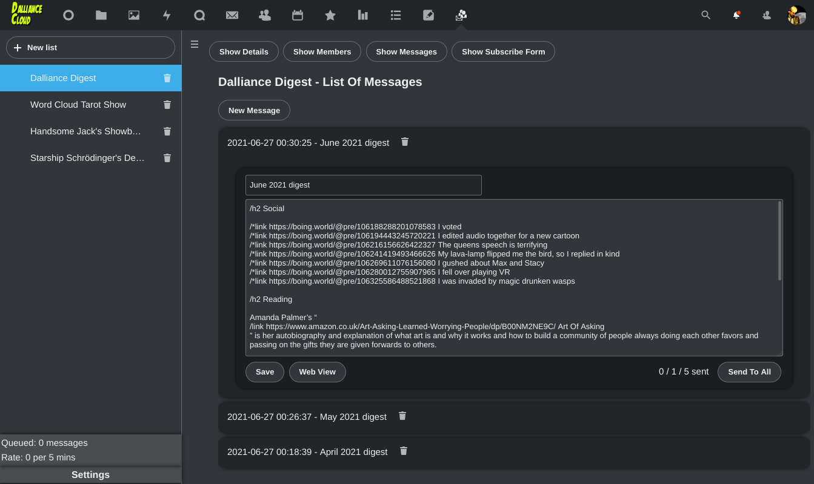

# Listman

This is a simple mailing-list manager.

It uses a separate SMTP configuration to the main Nextcloud
app, because often your "Transactional-only" email provider
will not allow mailing-list type email.

You will need to use the app as an Admin user to set those
SMTP settings before a non-admin user may use it.

Features:

* Multiple mailing-lists
* Subscribe/Unsubscribe forms
* A Web-view of each email sent, with "share on X" for
  * facebook
  * twitter
  * linked in
  * pinterest
  * Telegram
  * Email
  * Copy-link-to-clipboard
* Emojii React buttons on each email, tracked on the web-view page
* Every email has Un/Subscribe link
* Every email has "Forward" link, linking to the web-view
* Can assign a third button text and link per mail-list (I label it "chat" and link to a telegram group, you do what works for you)
* Footer per list for every email sent. 
* Allows subscribe-form to be generated for external site to link to Listman
* Max-Per-Day email settings, with queueing and warnings to users when exceeded
* Slowly but exponentially increase in send-rate
* HTML:
  * Headers
  * Links
  * Image-links
  * Bullet-links
* Sane plain-text version of every email too.

## Screenshots

The compose screen and a web-view of the email sent:




## Message Syntax

In composed messages you may use special commands. Put them in a
line of their own starting with a slash.

### Headers
EG:
```
   /h1 Welcome To This Email
```

Can use /h1 or /h2 or /h3 or /h4 

The rest of the line specifies the headline text.

### Links
EG:
```
   /link https://dalliance.net/ My Home Page
```

Specify the link first, then the text for the link in the rest of the line.

### Bullet Links
EG:
```
   /*link https://dalliance.net/ Homepage One
   /*link https://starshipsd.com/ My VR Cartoons
   /*link https://wordcloudtarot.com/ My tarot readings
   /*link https://tentacles.org.uk/ My tentacle monster cartoon
```

I find I want a bullet-point list of links often, so that's
for that.

### Image Links
EG:
```
   /img https://dalliance.net/avatar.jpg My Avatar with alt-text
```

Add an image in-line by linking to the Image's URL and 
adding alt-text/title for the rest of the line.


## Description

Your lists are in the left-hand column. Click one, or the "new list" button to create one.

You then have four buttons on the right-hand display:
* Show Details
* Show Members
* Show Messages
* Show Subscribe Form

### Show Details
Allows you to edit the title of the list, it's description, the name
and email of the "sender", the name and link for the 3rd button,
a footer, and a URL to return to after a subscribe.

### Show Members
Lists the member's names, emails, and their status.

Status may be:
* Unconfirmed
* Subscribed
* Blocked
* Queued

It only hits "Queued" if we can't send a confirmation message
due to sending-limits.

You may add a new member, edit or delete existing ones,
but usually you'd prefer to allow users to sign up with
the subscribe-form I'd think.

Messages only get sent to "Subscribed" members, though
every morning the Queued ones get converted into "unconfirmed"
as some confirmation emails get sent.


### Show messages

Lists the messages sent to the list, and allows composing a new one.

Each message has a "Web View" link to preview how it should look.

It is NOT "what you see is what you get", email never can be really.

You may special commands to add links, images, headers etc.

It has a "Send to all" button, which will queue sending to all the members of the list.

### Show Subscribe Form

You can copy/paste the text shown into your website to 
add a "subscribe" form to that website.

It also has a button linking to the native subscribe-form
in case there is no website to link from.


## Settings

Settings panel is shown only to admin Nextcloud users.

It allows setting of SMTP details, and the limit of max-per-day
emails that the system will send.

## Install
To install it change into your Nextcloud's apps directory:

    cd nextcloud/apps

Then run:

    git clone https://github.com/revpriest/listman.git listman

Then install the dependencies using:

    make composer

## Frontend development

- Run `make dev-setup` to install the frontend dependencies
- To build the Javascript whenever you make changes, run `make build-js`

